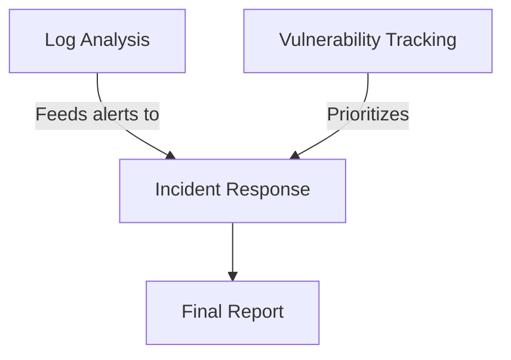

# **🚀 Your First Day as a Junior Security Analyst**  
*"Welcome to the SOC! I’m Alex, your team lead. Today, you’ll learn to detect and report incidents—the first steps in the NIST Incident Response Cycle."*  

---

## **📚 Survival Kit**  
### **1. NIST Incident Response Steps (Simplified for Beginners)**  
1. **Preparation**: Use notebooks/logs we provide *(you’re here!)*  
2. **Detection**: Find anomalies in logs/alerts *(your focus today)*  
3. **Containment**: *[Senior Analyst’s job]*  
4. **Eradication**: *[Security Engineer’s job]*  
5. **Recovery**: *[IT Team’s job]*  
6. **Lessons Learned**: *[Team review later]*  

> 🔍 **Your Role**: **Detection → Reporting** (Steps 2 + partial 1).  

---

## **💻 Your Missions**  
### **Mission 1: Log Analysis (NIST Detection Phase)**  
**Task**: Find brute force attacks in `auth.log`.  
**NIST Alignment**: *SP 800-92 (Log Management)*  
**Deliverable**: Fill the `incident_reports/template.md`.  

**Steps**:  
1. Run `01-log-analysis.ipynb`  
2. Count failed logins:  
   ```python
   failed_logins = log_data[log_data['status'] == 'Failed']
   print(f"🚨 Found {len(failed_logins)} attacks!")
   ```  
3. Report: *"5 failed root logins from 192.168.1.15 at 09:01 AM"*  

---

### **Mission 2: Vulnerability Check (NIST Preparation Phase)**  
**Task**: List critical CVEs in `vulnerability_scan.json`.  
**NIST Alignment**: *SP 800-40 (Vulnerability Management)*  
**Deliverable**: Add to report’s *"Recommended Next Steps"*.  

**Key Question**:  
> *"Does the attacker’s IP (192.168.1.15) match any vulnerable systems?"*  

---

### **Mission 3: Incident Reporting (NIST Lessons Learned Phase)**  
**Task**: Draft an email using `incident_reports/template.md`.  
**NIST Alignment**: *SP 800-61 (Incident Handling)*  

**Email Template**:  
```markdown
Subject: [Priority] Incident: Brute Force Attempts  

Hi Team,  

**Detection Time**: 2025-01-15 09:15 AM  
**What Happened**:  
- 5 failed root logins from 192.168.1.15  

**Evidence**:  
- Logs: `auth.log` (attached)  
- Analysis: `notebooks/01-log-analysis.ipynb`  

**Recommended**:  
1. Block IP in firewall *(Containment)*  
2. Check for other activity from this IP  

—[Your Name]  
Junior Analyst  
```

---

## **🔐 Why This Matters**  


- **You’re doing critical work**: Detection feeds the entire NIST cycle!  
- **Real SOCs use this**: Just with fancier tools (SIEMs, EDR).  

---

## **📌 Your Next Steps**  
1. **Try**: Complete `01-log-analysis.ipynb`  
2. **Ask**: *"What would trigger a Critical vs. Medium priority?"*  
3. **Learn**: [NIST SP 800-61r3](https://csrc.nist.gov/pubs/sp/800/61/r3/final)
   
> [!WARNING]   
> Always verify if the current NIST SP 800-61r3 version was Superseded  
> At the moment of the creation of this repo, the current version is NIST SP 800-61 Rev. 3   

> 👨‍🏫 *"Tomorrow, we’ll simulate containment! Today, master detection."*  
